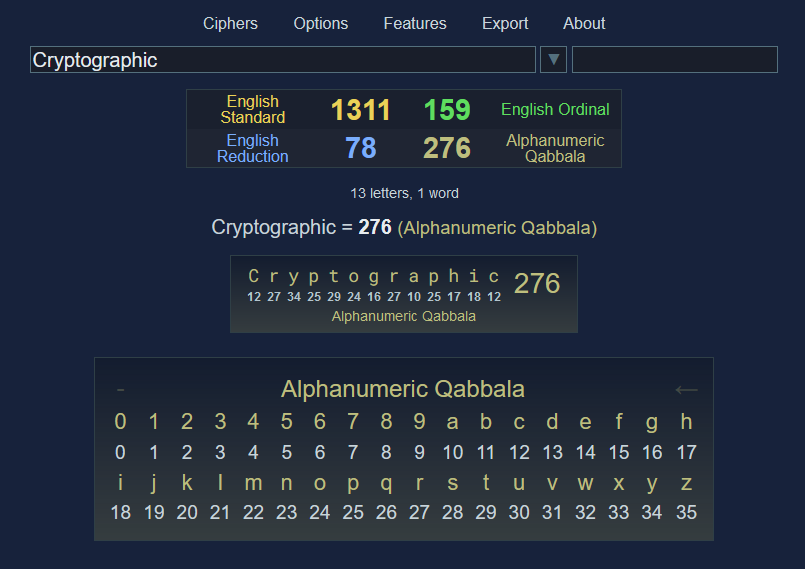

## GEMATRO - Gematria Calculator

---
> NOTE: Use a desktop Chromium based browser for best experience

### About This Calculator

This specific calculator is based entirely on the original [GEMATRO](https://gematro.github.io/) calculator by [Mikhail](https://github.com/gematro), with some changes, deletions and additions by [Alektryon](https://github.com/Alektryon):

<ul>
<li>Changed the default font from Montserrat to Arial</li>
<li>Deleted the "space" and "backspace" buttons from the cipher chart</li>
<li>Changed the default and available ciphers</li>
<li>Added some cryptographic ciphers (and others yet to be added, eventually)</li>
<li>Added a "Ciphers (Info)" menu, containing valuable information on all the ciphers, with bibliographical references</li>
<li>And a few other details here and there </li>
</ul>

### Features:
<ul>
<li>Dynamic highlighter with filtering</li>
<li>Support for characters with diacritical marks</li>
<li>Date calculator (offline)</li>
<li>Number properties (offline)</li>
<li>Database support (offline)</li>
<li>Encoding (offline)</li>
<li>History export/import (CSV format)</li>
<li>Fully customizable ciphers (Unicode)</li>
<li>Color controls</li>
<li>Screenshot tools</li>
<li>Quickstart guide included</li>
</ul>

